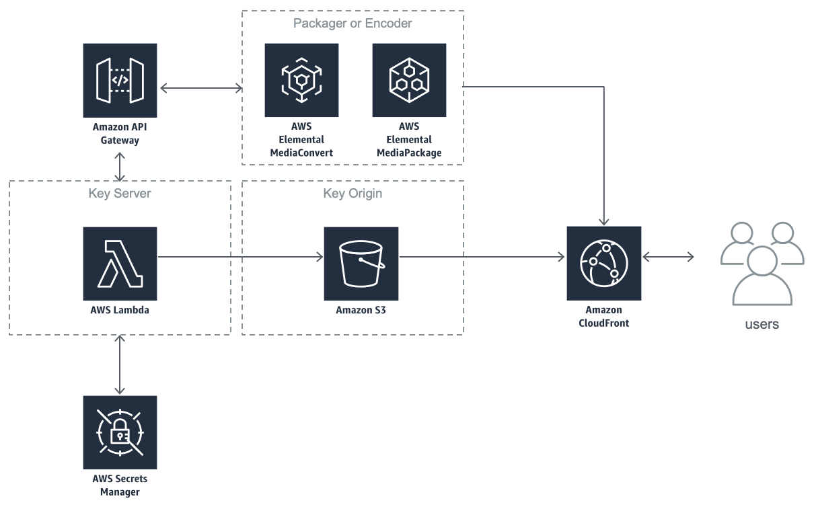

## SPEKE Reference Server

Secure Packager and Encoder Key Exchange (SPEKE) is part of the AWS Elemental content encryption protection strategy for media services customers. SPEKE defines the standard for communication between AWS Media Services and digital rights management (DRM) system key servers. SPEKE is used to supply keys to encrypt video on demand (VOD) content through AWS Elemental MediaConvert and for live content through AWS Elemental MediaPackage.

[This link](https://docs.aws.amazon.com/speke/latest/documentation/what-is-speke.html) will take you to high-level SPEKE documentation available on the AWS web site.

## Setup

Use the provided CloudFormation template to deploy the reference key server into your AWS account. The reference SPEKE implementation provides a key server and key distribution cache for end-to-end segment encyption with HLS and DASH. Use it as an example and starting point when implementing a complete DRM solution with SPEKE.

The CloudFormation template creates an API Gateway, Lambda function, S3 bucket and CloudFront distribution and adds the needed settings for the reference server. Additionally, the template creates IAM policies and roles necessary for API Gateway, Lambda, Secrets Manager, S3 and CloudFront to interact.

The following diagram shows the primary components of the serverless SPEKE solution and the connectivity among the components during runtime. The diagram also shows one possible integration between AWS MediaPackage or AWS MediaConvert and SPEKE.

These sections will guide you through installation, testing and configuration of the SPEKE Reference Server.

1. [**Installation**](INSTALL.md) - This page includes installation instructions for API Gateway, Lambda deployment and AWS Elemental MediaPackage channel integration.

2. [**Test Cases**](tests/README.md) - This page include several unit tests and manual test cases that can be used to verify operation of the SPEKE Reference Server. These test cases do not require integration with additional services.

3. [**AWS Elemental MediaPackage**](MEDIAPACKAGE_CONFIG.md) - This page documents steps that can be used to verify operation of the SPEKE Reference Server using AWS Elemental MediaPackage.

4. [**Contributing**](CONTRIBUTING.md) - This page includes the guidelines for contributing your enhancements, fixes and documentation to the project.

5. [**Code of Conduct**](CODE_OF_CONDUCT.md) - This is what we expect from all people interacting and contributing with the team.

## Limitations

This solution only supports key creation for the following DRM technologies:
Widevine
Playready

This solution will send a blank CPIX response if the Apple Fairplay system ID is used.

This solution only supports the contentProtection method to handle communication between the reference server solution and the Media Services. 
Users must implement copyProtectionData methods in order to handle client/player request to decrypt content.

